* Table of Contents
{:toc}

--------------------------------------------------------------------------------------------------------------------

## Introduction

### Who is AscendNetwork for?

AscendNetwork is built with **network marketeers** in mind—people who often deal with numerous customers, and subordinates. It is specially designed for those who prefer or are comfortable with typing commands. By centralizing all contact information, you can organise and keep track of important contact details and stats.

<div markdown="span" class="alert alert-info">
**:information_source: Note:** We assume you have basic familiarity with your computer, such as downloading files and opening folders. Where advanced technical actions are required, we will guide you step-by-step.
</div>

### What can you expect?

1. A **fast** way to input and manage contacts. If you can type quickly, you’ll love the efficiency.
1. A **user-friendly interface** that still leverages simple text commands (just like chatting in a messaging app).

--------------------------------------------------------------------------------------------------------------------

## Quick Start

1. **Open up your “command terminal”**.
   * A command terminal is a program where you can type text-based commands to your computer.
   * On **Windows**, look for “Command Prompt” or “PowerShell” in your Start Menu.
   * On **Mac**, open “Terminal” from your Applications > Utilities folder.
   * On **Linux**, open the terminal you have installed.

1. **Check if Java 17 (or above) is installed**.
   * Type into the terminal:
     ```sh
     java -version
     ```
     You should see a string that includes the text 17. For example:
     ```sh
     java version "17"
     Java(TM) SE Runtime Environment (build 17)
     Java HotSpot(TM) 64-Bit Server VM (build 23.2-b04, mixed mode)
     ```
   * If Java is not found, or if the version is not 17, please follow the instruction on Oracle's website for your platform:
     * [Windows](https://docs.oracle.com/en/java/javase/17/install/installation-jdk-microsoft-windows-platforms.html#GUID-DAF345BA-B3E7-4CF2-B87A-B6662D691840)
     * [Mac](https://docs.oracle.com/en/java/javase/17/install/installation-jdk-macos.html#GUID-F575EB4A-70D3-4AB4-A20E-DBE95171AB5F)
     * [Linux](https://docs.oracle.com/en/java/javase/17/install/installation-jdk-linux-platforms.html#GUID-4A6BD592-1840-4BB4-A758-4CD49E9EE88B)

     Afterwards, repeat the step above to verify if it is installed.

1. **Download the latest `AscendNetwork.jar` file** from our [GitHub releases page](https://github.com/AY2425S2-CS2103T-T14-4/tp/releases).

   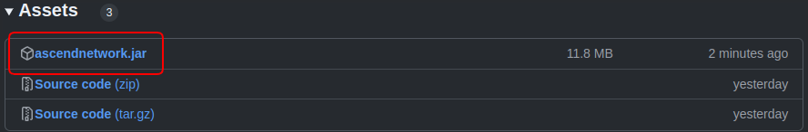

1. **Place the `.jar` file** into the folder you want to use as the “home folder” for AscendNetwork, which stores your data.
   * For example, you could create a folder called `AscendNetworkHome` on your Desktop.

1. **Run AscendNetwork**.
   * Still in your command terminal, use the `cd` command to move into that folder. For example:
     ```sh
     cd Desktop/AscendNetworkHome
     ```
   * Then type:
     ```sh
     java -jar AscendNetwork.jar
     ```
   * After a few seconds, the AscendNetwork interface should appear. You will see some sample contacts included by default.

   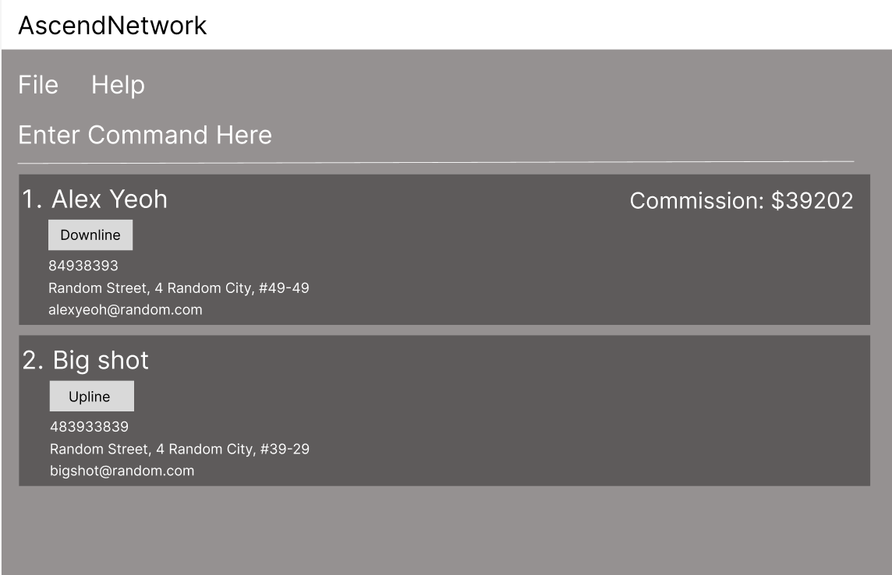

6. **Try out some commands** in the command box.

   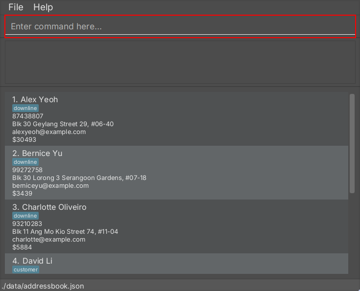

   * **`help`** : Opens the help window.
   * **`list`** : Lists all existing contacts.
   * **`add n/John Doe p/98765432 e/johnd@example.com a/John Street, block 123, #01-01`** : Adds a contact named `John Doe`, whos contact number is `98765432`, has an `email of johnd@example.com` and lives at `John Street, block 123, #01-01`.
   * **`delete 3`** : Deletes the 3rd contact in the current list.
   * **`clear`** : Deletes **all** contacts.
   * **`exit`** : Closes the app.

<div markdown="block" class="alert alert-info">

**:information_source: AscendNetwork commands follow a straightforward format:**

* **UPPER_CASE** words are placeholders (e.g., `NAME` in `add n/NAME`).
* **Square brackets `[ ]`** indicate optional items (e.g., `[t/TAG]`).
* **Items with `...`** can appear multiple times or not at all (e.g., `[t/TAG]...`).
* **Curly braces `{ }` separated by `|`** mean “choose one” (e.g., `{n/NAME | t/TAG}`).
* **Parameters can be in any order.**
* **Extraneous parameters** are ignored for commands that do not accept any (e.g., `help 123` is treated as `help`).
* **Whenever alphanumeric

_If you are reading this from a PDF, watch out for spacing issues when copying multi-line commands._
</div>

--------------------------------------------------------------------------------------------------------------------

## Features

### Viewing help : `help`

Shows a message explaning how to access the help page.


Format: `help`


### Adding a contact: `add`

Adds a contact to the address book.

Format: `add n/NAME p/PHONE_NUMBER e/EMAIL a/ADDRESS c/COMMISSION [t/TAG]...​`

<div markdown="span" class="alert alert-primary">:bulb: **Tip:**
A contact can have any number of tags (including 0)
</div>

* Provide **all fields**—tag is optional.
* NAME uses **only alphanumeric characters and spaces**. It must **not be blank**.
* PHONE_NUMBER is a **number** that is **at least 3** digits long.
* ADDRESS accepts any value, but it must **not be blank**.
* EMAIL follows the **local-part@domain** format. Please note:
  1. Include **only alphanumeric characters and these special characters, excluding the parentheses: (+_.-)** in the local part. It must **not start or end with a special character**.
  2. After the local part, add an '@' followed by a domain name composed of labels separated by periods.
     - The domain name **must end** with a domain label that is **at least 2** characters long.
     - Each domain label should **start and end** with an alphanumeric character.
     - Each domain label may contain **only alphanumeric** characters, with hyphens allowed in between if necessary.
* COMMISSION is an **non-negative integer** number, **not starting with 0**. It must be **at most 9** digits long, and **cannot be blank**.
* TAG consists of **alphanumeric** characters.

Examples:
* `add n/John Doe p/98765432 e/johnd@example.com a/John street, block 123, #01-01 c/0`
* `add n/Betsy Crowe c/10000 e/betsycrowe@example.com a/Chicago ave p/1234567 t/customer`
  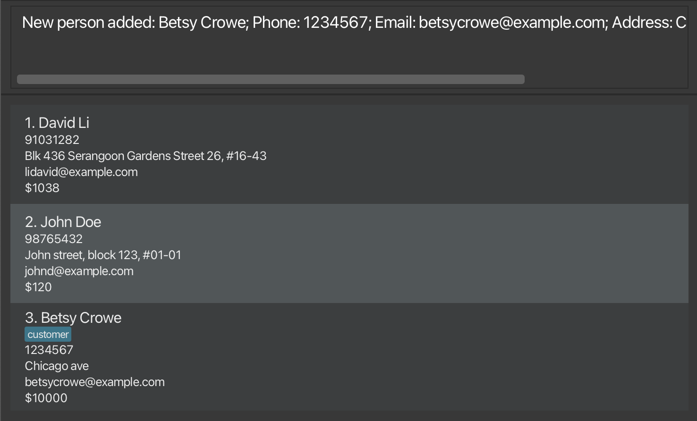

### Listing all persons : `list`

Shows a list of all persons in the address book.

Format: `list`

### Editing a contact : `edit`

Edits an existing contact in the address book.

Format: `edit INDEX [n/NAME] [p/PHONE] [e/EMAIL] [a/ADDRESS] [c/COMMISSION] [t/TAG]...​`

<div markdown="span" class="alert alert-primary">:bulb: **Tip:**
Update your contact details if you make a mistake
</div>

* Edits the contact at the specified `INDEX`. The index refers to the index number shown in the displayed contact list. The index **must be a positive integer** 1, 2, 3, ...​
* **At least one of** the optional fields must be provided.
* Existing values will be updated to the input values.
* Removes the existing tags of the contact when edits i.e. adding of tags is not cumulative.
* You can remove all the contacts’ tags by typing `t/` without
    specifying any tags after it.

Examples:
*  `edit 1 p/91234567 e/johndoe@example.com` Edits the phone number and email address of the 1st contact to be `91234567` and `johndoe@example.com` respectively.
*  `edit 2 n/Betsy Crower t/` Edits the name of the 2nd contact to be `Betsy Crower` and clears all existing tags.
*  `edit 3 c/120` Edits the commission of the 3rd contact to be `120`.
   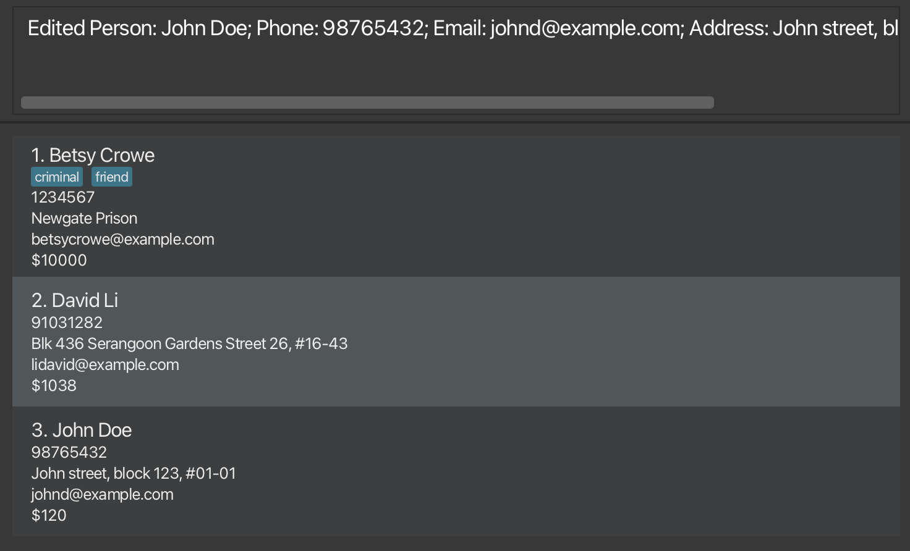

### Locating your contacts: `find`

Finds contacts by matching name and tag keywords you provide.

Format: `find {n/NAME_KEYWORD [NAME_KEYWORD]... [t/TAG_KEYWORD...] | t/TAG_KEYWORD [TAG_KEYWORD]... [n/NAME_KEYWORD...]}`

<div markdown="span" class="alert alert-primary">:bulb: **Tip**: Run this command to control which contacts are affected by commands that act on ones which the app displays</div>

* `NAME_KEYWORD` is a **single word** searching only name. e.g. In `n/Hans Bo` both `Hans` and `Bo` are keywords
* `TAG_KEYWORD` is a **single word** searching only tags. e.g. In `t/downline customer` both `downline` and `customer` are keywords
* Supply **at least one** of `n/NAME_KEYWORD` or `t/TAG_KEYWORD`.
* When providing only `NAME_KEYWORD`, finds contacts whose name contain at least one keyword (i.e. `OR` search). e.g. Providing `n/Hans Bo` finds `Hans Gruber`, `Bo Yang`
* When providing only `TAG_KEYWORD`, finds contacts whose tags contain at least one keyword (i.e. `OR` search). e.g. Providing `t/downline customer` finds contacts with tags `downline` and `family`, as well as contacts with tags `customer` and `friend`
* When providing both `NAME_KEYWORD` and `TAG_KEYWORD`, finds contacts matching both name and tag search (i.e. `AND` search between name and tags). e.g. Providing `n/Hans Bo t/downline customer` finds `Hans Gruber` and with tags `downline` and `family`, but not `Bo Yang` with tags `family` and `friend`
* Searching ignores case. e.g `n/hans` matches `Hans` name, `t/customer` matches `Customer` tag
* The order of the keywords does not matter. e.g. `n/Hans Bo` matches `Bo Hans` name, `t/downline customer` matches `customer` and `downline` tags
* Matches only full words. e.g. `n/Han` does not match `Hans` name, `t/downlines` does not match `downline` tag

Examples:
* `find n/John` finds `john` and `John Doe`
* `find n/alex david t/downline customer` finds `Alex Yeoh` with tag `downline`, `David Li` with tag `customer`<br>
  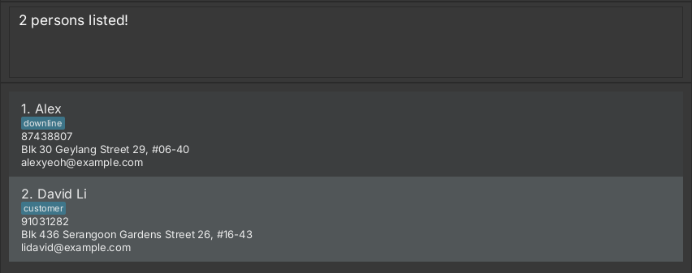

### Tagging multiple contacts at once: `tag`

Adds tag(s) you specify to multiple contacts.

Format: `tag TAG [TAG]...`

<div markdown="span" class="alert alert-warning">:exclamation: **Caution:** Ensure you filter to the correct group of contacts before using the command, or it may add tags to contacts unintentionally.</div>

* Display **at least one contact** before running the command.
* `TAG` is a word of **digits or letters (both uppercase and lowercase)**. e.g. `customer1`
* Adds all `Tag` to your contacts which the app currently displays. e.g. Running `tag customer` when only `Hans` and `Bo` are displayed adds the `customer` tag only to them.
* Appends to your contact's existing tags instead of replacing. e.g. Running `tag vip` when a displayed contact with `customer` tag changes their tag to `customer vip`
* Skips contacts who already have all `TAG`.

Examples:
* `tag downline` adds the `downline` tag to all your contacts in the current list.
* `find n/david irfan` followed by `tag customer vip` adds both `customer` and `vip` tags to contacts in the result of `find` command.
  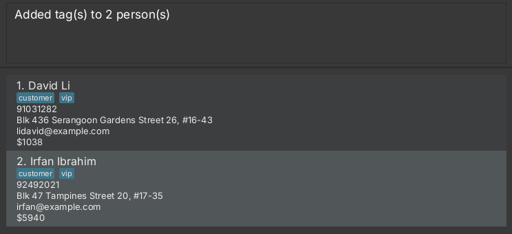

### Removing tags from multiple contacts: `rmtag`

Removes tag(s) you specify from multiple contacts.

Format: `rmtag TAG [TAG]...`

<div markdown="span" class="alert alert-warning">:exclamation: **Caution:** Ensure you filter to the correct group of contacts before using the command, or it may remove tags from contacts unintentionally.</div>

<div markdown="span" class="alert alert-primary">:bulb: **Tip:** You can use this command to manage temporary tags that no longer applies to multiple contacts at the same time. e.g. An event that ended.</div>

* Display **at least one contact** before running the command.
* `TAG` is a word of **digits or letters (both uppercase and lowercase)**. e.g. `customer1`
* Removes all `Tag` from your contacts the app currently displays. e.g. Running `rmtag customer` when only `Hans` and `Bo`, that both have `customer`, are displayed tag removes it only from them.
* Skips contacts who do not have any `TAG`.

Examples:
* `rmtag meeting` removes the `meeting` tag from all your contacts in the displayed list.
* `find n/david irfan` followed by `rmtag customer vip` removes both `customer` and `vip` tags from contacts in the result of `find` command.
  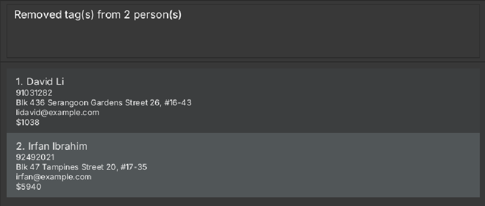

### Including your contacts by name to specific group: `incl`

Adding contacts with matching name from your contacts to the list.

Format: `incl n/NAME_KEYWORD [NAME_KEYWORD]...`

<div markdown="span" class="alert alert-primary">:bulb: **Tip:**
Use this command to quickly add your favorite contacts to the displayed list.
</div>

* `NAME_KEYWORD` is same as defined above.
* Supply **at least one** of `n/NAME_KEYWORD`
* It includes contacts whose name contain at least one keyword. e.g. Providing `n/Hans Bo` includes `Hans Gruber`, `Bo Yang`
* The order of the keywords does not matter. e.g. `n/Hans Bo` matches `Bo Hans` name
* Searching ignores case for the name. e.g `n/hans` matches `Hans` name
* Matches only full words e.g. `n/Han` does not match `Hans` name

Examples:
* `incl n/John` finds `john` and `John Doe`
* `find n/john betsy` follwed by `incl n/Li` adds `David Li` to the list
  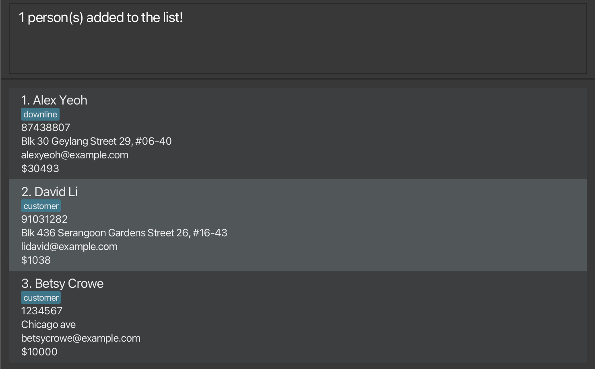

### Add commission to the contact: `addc`

Adds commission to the contact. 

Format: `addc INDEX c/COMMISSION`

<div markdown="span" class="alert alert-primary">:bulb: **Tip:**
Quickly add commission to your contact without manually calculating and editing.
</div>

* Adds commission to the contact at the specified `INDEX`. The index refers to the index number shown in the displayed contacts list. The index **must be a positive integer** 1, 2, 3, ...​
* The commission value **must be a non-negative integer** and can have **up to 9 digits.**

Examples:
* `addc 1 c/12`: Adds 12 commission to the 1st contact. 
  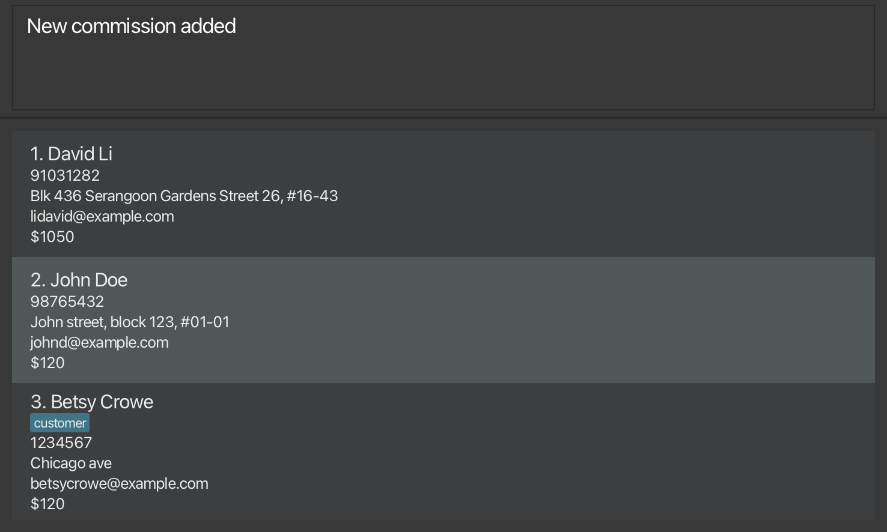
### Export contacts to a CSV file: `export`

Effortlessly export your contacts to a CSV file that can be edited in software like Excel or Google Sheets.

Format: `export FILE_NAME [a/ATTRIBUTE]...`

<div markdown="span" class="alert alert-primary">:bulb: **Tip:** The command will fail if the file already exists, so that your data won't be lost unintentionally. On some systems like Windows, file names are case-insensitive. For example, if you already have a `DATA.csv`, then AscendNetwork cannot export your data to `data.csv`.</div>

<div markdown="span" class="alert alert-primary">:bulb: **Tip:** Use filters before exporting to segment your contacts, e.g., exporting only high-commission leads.</div>

* `FILE_NAME` is a file name that **starts with only alphanumeric characters** and **ends with the suffix `.csv`**. We recommend that you keep its length **under 256 characters**.
* `ATTRIBUTE` may be **`name`, `phone`, `email`, `address`, or `commission`**. It is case-insensitive. You should not use the same `ATTRIBUTE` twice.
* Exports the currently displayed contacts only. Use `find` and/or other commands to refine your selection before running this command.

Examples:
* `export data.csv a/NAME a/email`: Exports only names and emails—perfect for email campaigns!
* `export data.csv`: Exports all details of the currently displayed contacts to `data.csv`.
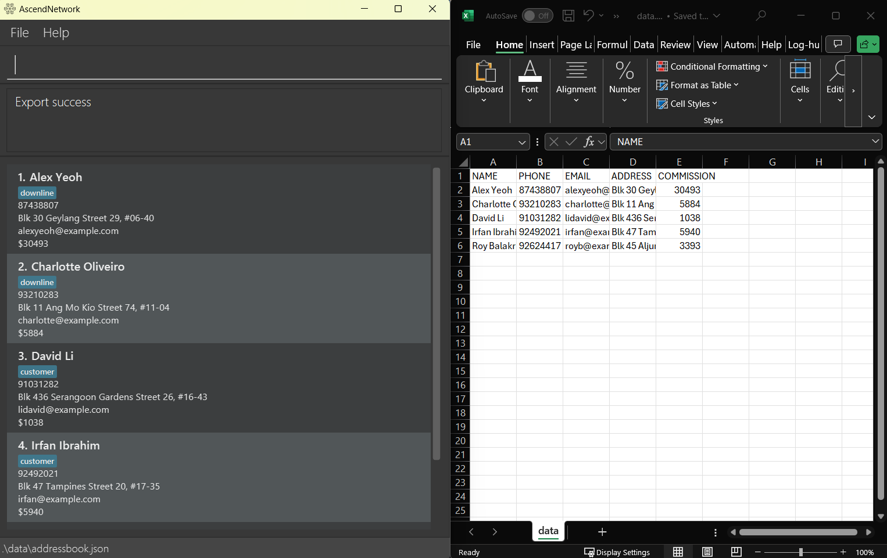

### Deleting a contact : `delete`

Deletes contact you specify from the application.

Format: `delete INDEX`

* `INDEX` is a **positive integer** that matches **a contact's position** that the app currently displays. e.g. 1, 2, 3, ...
* Deletes the contacts the app currently displays at position `INDEX`.

Examples:
* `list` followed by `delete 2` deletes the 2nd contact in the address book.
* `find n/Alex` followed by `delete 1` deletes the 1st contact in the results of the `find` command.
  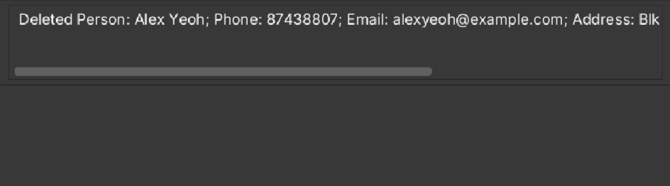

### Clearing all contacts : `clear`

Clears all contacts from the application.

Format: `clear`

<div markdown="span" class="alert alert-warning">:exclamation: **Caution:** This will delete **ALL** contacts, regardless if they are displayed or not.</div>

<div markdown="span" class="alert alert-primary">:bulb: **Tip:** You can use this command to start a fresh list of contacts.</div>

Examples:
* `clear` clears all contacts
  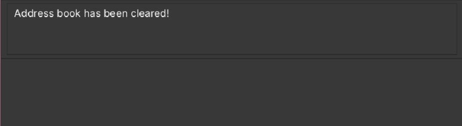

### Exiting the program : `exit`

Exits the program.

Format: `exit`

### Mail to multiple contacts: `mailto`

Quickly create an email link to send messages to multiple contacts using your preferred email client.

Format: `mailto`

<div markdown="span" class="alert alert-primary">:bulb: **Tip:** You should first filter to the correct group of contacts</div>

* You will need to copy the link and paste it on your browser's address bar to send emails.
* The default email client set on your system will be used to send the email.
* Includes the currently displayed contacts only. (in the `mailto://` link) Use `find` and/or other commands to refine your selection before running this command.

Examples:
* `mailto`: Generates a link that opens your email client with recipients pre-filled.
  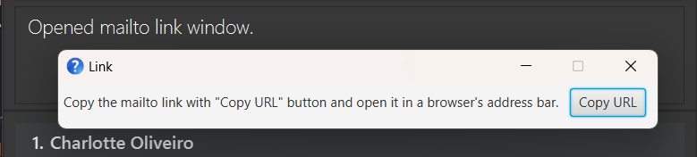

### Sorting commissions by amount : `comm`

Sorts the currently displayed list of commissions by their amount in ascending or descending order.

Format: `comm s/DIR`

<div markdown="span" class="alert alert-primary">:bulb: **Tip:** Use this command to easily view commissions starting from the lowest amount.</div>

* `DIR` is `asc` for ascending and `desc` for descending

Examples:
* `comm s/asc` sorts the displayed commissions from the smallest amount to the largest amount and prints it in the program display.
  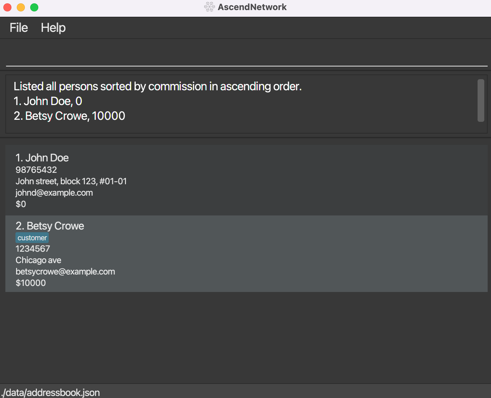

### Displaying summary statistics : `summary`

Displays a summary of key statistics: total number of contacts, total commission, highest commission, lowest commission, and average commission across all stored contacts in easy to read format.

Format: `summary`

<div markdown="span" class="alert alert-primary">:bulb: **Tip:** Use this command for a quick statistical overview of your stored data without needing to list all entries.</div>

Examples:
* `summary` displays the general statistics for all contacts.
  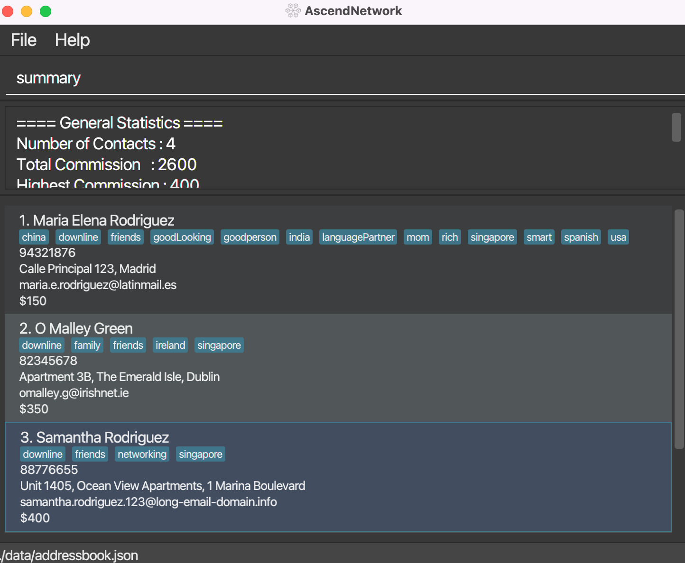

--------------------------------------------------------------------------------------------------------------------

## Managing your data

### Saving the data

AscendNetwork saves its data in the hard disk automatically after any command that changes the data. There is no need to save manually.

### Editing the data file

AscendNetwork saves its data automatically as a JSON file `[JAR file location]/data/addressbook.json`. JSON (short for JavaScript Object Notation) is a text-based data format that is human-readable. Advanced users are welcome to update data directly by editing that data file.

<div markdown="span" class="alert alert-warning">:exclamation: **Caution:**
If your changes to the data file makes its format invalid, AscendNetwork will discard all data and start with an empty data file at the next run. Hence, it is recommended to take a backup of the file before editing it.<br>
Furthermore, certain edits can cause the AscendNetwork to behave in unexpected ways (e.g., if a value entered is outside of the acceptable range). Therefore, edit the data file only if you are confident that you can update it correctly.
</div>

--------------------------------------------------------------------------------------------------------------------

## FAQ

**Q**: How do I transfer my data to another Computer?<br>
**A**: Install the app in the other computer and overwrite the empty data file it creates with the file that contains the data of your previous AscendNetwork home folder.

**Q**: How can I back up my data?<br>
**A**: You can manually back up your `addressbook.json` file by copying it to a safe location.

**Q**: Can I import contacts from another system?<br>
**A**: Currently, AscendNetwork does not support direct imports from CSV or other contact management systems.

**Q**: Can I export contacts to another system?<br>
**A**: Yes, you can export selected contacts as CSV with the `export` command. Then you can import contacts from CSV to external systems that support imports, such as Google Contacts.

**Q**: Can multiple users access the same address book?<br>
**A**: AscendNetwork is designed for single-user use. If multiple users need to access the same contact database, they must manually share the `addressbook.json` file.

**Q**: Will AscendNetwork work on mobile devices?<br>
**A**: No, AscendNetwork is designed for desktop operating systems such as Windows, macOS, and Linux.

**Q**: Will AscendNetwork work on older operating systems?<br>
**A**: No, AscendNetwork is designed for modern desktop operating systems such as Windows 10 or later, macOS 10.15 or later, and Ubuntu 18.04 or later. AscendNetwork might not work on other Linux distros or custom setups.

**Q**: Will AscendNetwork data be saved properly on older storage media, such as floppy disks or DVDs?<br>
**A**: No, AscendNetwork is designed for modern storage media like USB, and file systems like NTFS.

**Q**: Does AscendNetwork require an internet connection?<br>
**A**: No, all data is stored locally on your device, and the app works entirely offline.

**Q**: How many contacts can AscendNetwork keep?<br>
**A**: While there is no hard limit, we advise not having more than 1000 contacts for performance reasons.

**Q**: How do I update AscendNetwork to a newer version?<br>
**A**: Download the latest .jar file from [here](https://github.com/AY2425S2-CS2103T-T14-4/tp/releases) and replace your existing .jar file with the new one. Your data will remain intact if it is stored in the same folder.

--------------------------------------------------------------------------------------------------------------------

## Known issues

1. **When using multiple screens**, if you move the application to a secondary screen, and later switch to using only the primary screen, the GUI will open off-screen. The remedy is to delete the `preferences.json` file created by the application before running the application again.
2. **If you minimize the Help Window** and then run the `help` command (or use the `Help` menu, or the keyboard shortcut `F1`) again, the original Help Window will remain minimized, and no new Help Window will appear. The remedy is to manually restore the minimized Help Window.

--------------------------------------------------------------------------------------------------------------------

## Command summary

Action | Format, Examples
--------|------------------
**Add** | `add n/NAME p/PHONE_NUMBER e/EMAIL a/ADDRESS [t/TAG]...​` <br> e.g., `add n/James Ho p/22224444 e/jamesho@example.com a/123, Clementi Rd, 1234665 t/friend t/colleague`
**Clear** | `clear`
**Delete** | `delete INDEX`<br> e.g., `delete 3`
**Edit** | `edit INDEX [n/NAME] [p/PHONE_NUMBER] [e/EMAIL] [a/ADDRESS] [t/TAG]...​`<br> e.g.,`edit 2 n/James Lee e/jameslee@example.com`
**Find** | `find {n/NAME_KEYWORD [NAME_KEYWORD]... [t/TAG_KEYWORD...] \| t/TAG_KEYWORD [TAG_KEYWORD]... [n/NAME_KEYWORD...]}` <br> e.g., `find n/James Jake t/downline customer`
**Addc** | `addc INDEX c/COMMISSION` <br> e.g. `addc 4 c/1500`
**Tag** | `tag TAG [TAG]...` e.g. `tag customer vip`
**Remove Tag** | `rmtag TAG [TAG]...`<br> e.g. `rmtag customer vip`
**Export** | `export FILE_NAME [a/ATTRIBUTE]...`
**Mailto** | `mailto`
**List** | `list`
**Help** | `help`
**Incl** | `incl n/NAME_KEYWORD [NAME_KEYWORD]...` <br> e.g. `incl n/James joe`
**Comm** | `comm s/SORT_DIRECTION` <br> e.g. `comm s/asc`
**summary** | `summary` <br> e.g. `summary`
